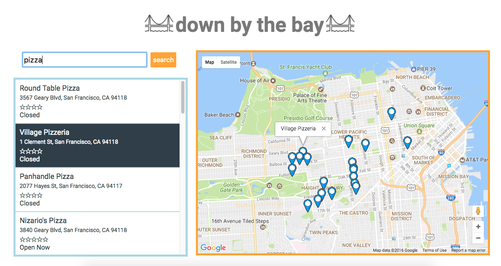

# Down By the Bay

###[live](https://jhauf.github.io/DownByTheBay/)

Down by the Bay is an interactive map built with `JavaScript`, `HTML5`, `CSS3` and the `Google Maps Places` library.
 The search results display name, address, rating and hours and are connected to the markers. When the user hovers over a result, the info window appears over the corresponding marker. In addition, a loader appears while the map loads.

### Architecture and Technologies

This project was implemented with the following technologies:

- `Vanilla JavaScript` for structure and game logic
- `HTML5` for DOM manipulation and rendering
- `CSS3` for styling
- `Webpack` to bundle

In addition to the `Webpack` entry file, there were three other scripts involved in this project:

- `main.js`: this script creates a new `Map` when the page is loaded and listens for searches (either from clicking enter or pressing the enter key)
- `places.js`: this script constructs the `Places` Class which calls the 'Google Maps Places' library with the query parameters from the user. It displays the results and instantiates new `Markers`
- `marker.js`: this holds the `Marker` class and handles the logic of initializing a new marker, with a mouseover listener to display the info window
